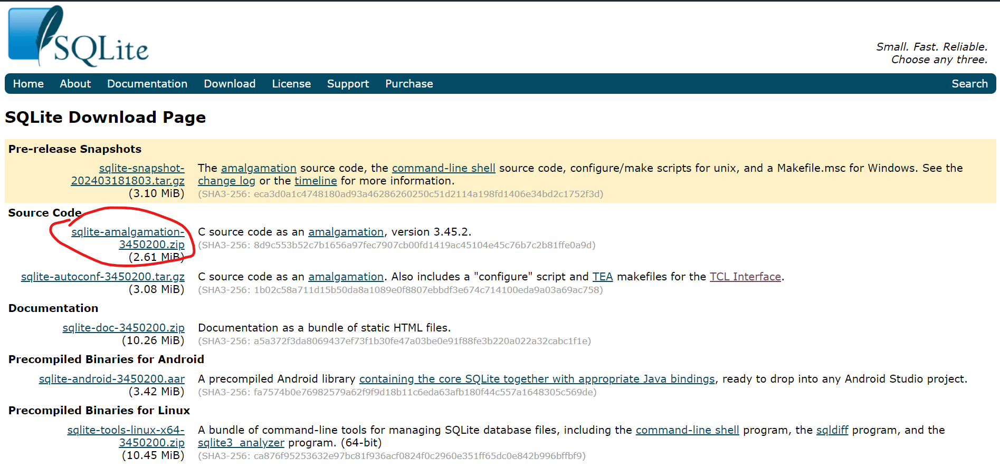
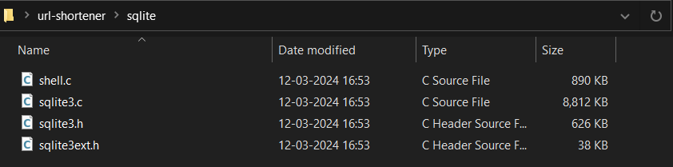
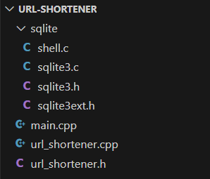
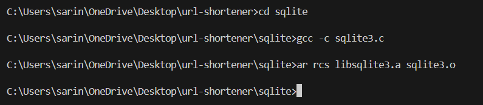
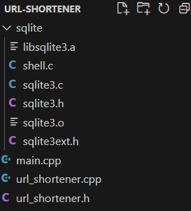
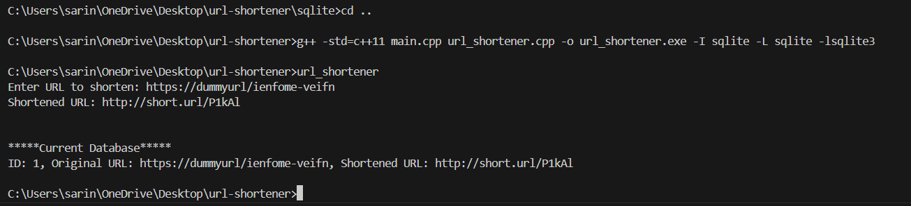
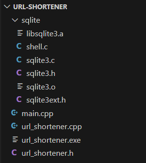
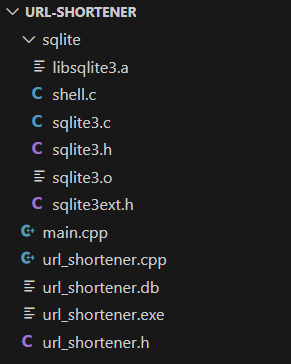
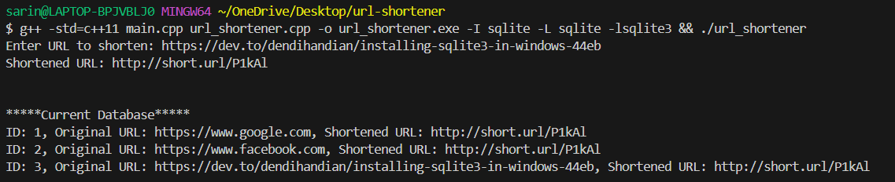

# URL Shortener

This is a simple URL shortener script written in C++ that uses sqlite3 as a database. The script takes a URL as input and returns a shortened URL. The shortened URL is generated by hashing the original URL and storing it in the database. The script then returns the shortened URL by querying the database with the hash. The script also has a feature to check if the shortened URL is valid and returns the original URL if it is.

# Installation Steps 

This is a step-by-step guide to install the required sqlite files and compile the code to run the url shortener script. It has been tested on a Windows machine, but should work on any OS with minor modifications. Feel free to reach out to me if you have any issues.

#### NOTE: Feel free to skip to step 5 to run the script as I have already compiled the required sqlite files here

**STEP 1:** install sqlite amalgation files from below link:

<https://www.sqlite.org/download.html>

**STEP 2:**  unzip the files into a new folder named “sqlite” in your root directory:

**STEP 3:**  open the root directory folder in a new vscode window, and your current file structure should be like:

**STEP 4:**  open the terminal and and run the following commands to go to the sqlite directory and compile our sqlite code:

1. `cd sqlite`
1. `gcc -c sqlite3.c`
1. `ar rcs libsqlite3.a sqlite3.o`

Your file structure should now look like:

**STEP 5:** now run the following commands to go back to the root directory and compile our code:

1. `cd ..`
1. `g++ -std=c++11 main.cpp url\_shortener.cpp -o url\_shortener.exe -I sqlite -L sqlite -lsqlite3`

the file directory should have an executable file now:

**STEP 6:** now, run the below command to run the executable, then input any url to shorten it:

1. `url\_shortener`

The file directory should have a database file (url\_shortener.db) now:

---

# Sample Output:

